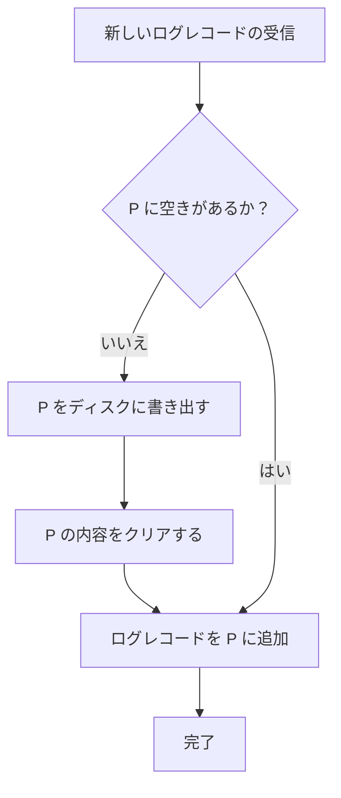
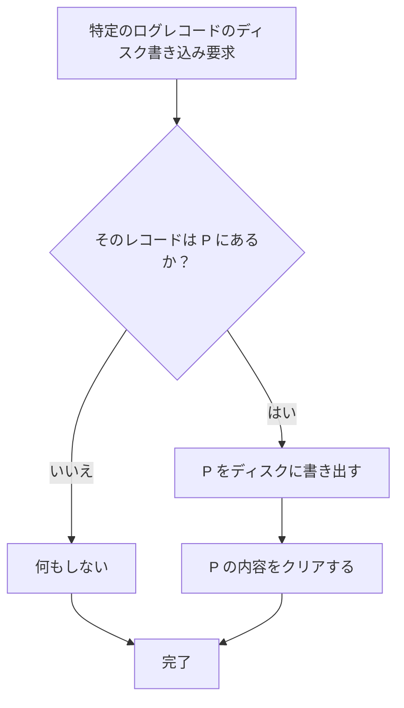

データベースエンジンでは、データの変更内容を **ログレコード** としてログファイルの末尾に次々と記録していきます。  
各ログレコードには **LSN (Log Sequence Number)** というシーケンス番号が付与され識別されます。

## ログマネージャ

ログマネージャはログレコードをログファイルに書き込む役割を担うデータベースエンジンのコンポーネントです。

ログマネージャはログファイルの最後のブロック内容を保持するページ (P) 1 つを恒久的に割り当て、基本的にページ単位 (ブロック単位) でログレコードをディスクに書き込みます。データ変更のたびにディスク I/O を行っているのでは、パフォーマンスが低下するからです。  
しかし、何らかの外的要因によって、ページに空きがある状態でもログレコードをディスクに書き込む必要が生じる可能性があります。そのため、ログマネージャは、**ページが満杯になったとき** と **ログレコードの強制的なディスク書き込みが必要なとき** の 2 つのタイミングでディスクに書き込みを行います。

